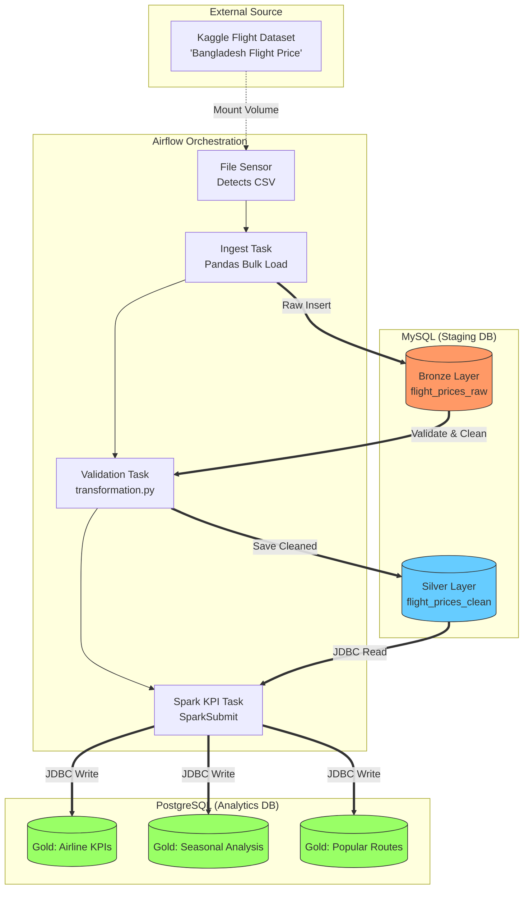
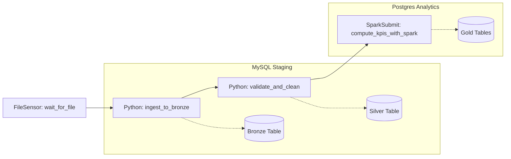

# Project Report: Bangladesh Flight Price Data Pipeline

## 1. Project Overview
This project involved building a robust, end-to-end data engineering pipeline to analyze flight pricing trends in Bangladesh. The goal was to move raw data from a Kaggle CSV dataset through a multi-stage **Medallion Architecture** to generate actionable insights regarding airline performance, seasonal price variations, and popular travel routes.

## 2. System Architecture
The pipeline is orchestrated using **Apache Airflow** and utilizes a containerized environment to ensure scalability and isolation.

### Architecture Diagram
In a Medallion Architecture, data quality and structure improve as it moves through each layer. This approach ensures that I have a "single source of truth" (Bronze) while providing high-performance, refined data for the end user (Gold).

1. **Bronze Layer (MySQL):** The Raw Ingestion Zone
The primary goal of the Bronze layer is to capture the source data exactly as it exists in the original Kaggle CSV file.

* **Immutable Storage:** Data is stored in its rawest form, serving as a permanent record of what was received.

* **Handling Raw Headers:** This layer was specifically designed to handle the original CSV column names, including spaces and units like Total Fare (BDT) and Arrival Date & Time.

* **No Transformation:** No logic is applied here; the priority is high-speed bulk loading to ensure the data is safe within the database environment.

2. **Silver Layer (MySQL):** The Validated & Cleaned Zone
The Silver layer is where the "heavy lifting" of data quality occurs. This layer acts as the foundation for all downstream analytical processing.

* **Data Validation:** The transformation.py script enforces data contracts, such as ensuring no null values exist for critical fields like "Airline".

* **Corrected Calculations:** A key business logic step here is re-calculating the Total Fare to ensure it accurately reflects the sum of Base Fare + Tax & Surcharge.

* **Standardization:** Data types are cast from general strings (from the CSV) into decimals, integers, and timestamps, making the data compatible with Apache Spark.

3. **Gold Layer (PostgreSQL):** The Curated Analytics Zone
The Gold layer is the final destination, containing data that has been aggregated and optimized for specific business questions.

* **Aggregated KPIs:** Unlike previous layers, Gold does not contain every individual flight record. Instead, it stores summaries like Average Fare by Airline or Booking Counts.

* **Seasonal Insights:** Using Apache Spark, data is categorized into "Peak" and "Non-Peak" seasons (identifying Eid and Winter holidays) to compare pricing trends.

* **Business Intelligence Ready:** By moving the final output to PostgreSQL, the data is separated from the staging environment, allowing BI tools or stakeholders to query high-speed tables like gold_popular_routes without affecting the main pipeline.

## Airflow DAG & Task Description
This section provides a detailed breakdown of the flight_price_analysis_pipeline DAG. The pipeline is designed following the Medallion Architecture, ensuring data moves through structured stages of refinement.

### DAG Overview
* DAG ID: flight_price_analysis_pipeline
* Schedule: Manual/Scheduled (as per project requirements)
* Owner: Courage
* Purpose: Orchestrates the ingestion of Bangladesh flight data from CSV to a PostgreSQL analytics warehouse.

**Detailed Task Descriptions**

The DAG consists of four primary tasks that handle the data lifecycle from extraction to aggregation.

### Airflow DAG Task Breakdown

| Task ID                  | Operator              | Description |
|--------------------------|-----------------------|-------------|
| `wait_for_file`          | FileSensor            | Monitors a specific local directory for the arrival of the Kaggle CSV dataset. The pipeline only begins once the file is detected. |
| `ingest_to_bronze`       | PythonOperator        | Performs a bulk load of the raw CSV data into the MySQL Bronze Layer (`flight_prices_raw`). It preserves all original headers and raw strings. |
| `validate_and_clean`     | PythonOperator        | Executes the `transformation.py` script. It filters nulls, standardizes data types, and re-calculates the **Total Fare** to ensure data integrity in the Silver Layer. |
| `compute_kpis_with_spark`| SparkSubmitOperator   | Triggers an Apache Spark job to perform heavy aggregations. It computes seasonal variations (Peak vs. Non-Peak) and popular routes, then writes results to the PostgreSQL Gold Layer. |

### Architecture Deep Dive

**1. The Ingestion Logic (Bronze)**
* **Schema Preservation:** The ingestion task is configured to handle the specific naming conventions found in the Bangladesh flight dataset, such as Total Fare (BDT).
* **Staging:** Data is stored in MySQL to act as a persistent staging area, allowing for re-processing if downstream tasks fail.

**2. The Transformation Logic (Silver)**
* **Business Rules:** This task applies the rule: $Total Fare = Base Fare + Tax$ to correct any inconsistencies in the source data.
* **Formatting:** Arrival and departure strings are converted into SQL-compatible TIMESTAMP formats.

**3. The Analytical Logic (Gold)**
* **Spark Processing:** Leverages Spark’s distributed processing to categorize records into Peak (Eid/Winter) and Non-Peak categories using regex patterns.
* **Result Persistence:** The final output is written to PostgreSQL, which is optimized for "Read-Heavy" analytical queries and reporting.

## KPI definitions and computation logic.
**1. Seasonal Fare Variation**
This KPI identifies how flight prices fluctuate during high-demand periods in Bangladesh compared to standard travel dates.
* **Definition:** The average `Total Fare` grouped by seasonal categories: **Peak** (Holidays) and **Non-Peak**(Regular).
* **Computation Logic:**
    * **Categorization:** A Spark User Defined Function (UDF) or regex pattern scans the `Date` or `Travel_Event` strings. 
    * **Classification: Peak:** Any record containing keywords such as "Winter", "Eid", "Christmas", or specific holiday date ranges.
        * **Non-Peak:** All other travel dates.
* **Aggregation:** 
$$Avg\_Fare = \frac{\sum Total\_Fare}{Count(Flights)}$$
This is calculated for each category and loaded into gold_seasonal_analysis.

### 2. Top 10 Popular Routes
This KPI highlights the most frequently traveled corridors, which is essential for understanding airline traffic and demand.
* **Definition:** The top 10 unique combinations of Source and Destination based on the total number of bookings.
* **Computation Logic:**
    * **Grouping**: Spark groups the data by the composite key (Source, Destination).
    * **Counting**: Performs a count(*) on each group.
    * **Ranking**: Orders the results in descending order by the count and limits the output to 10 records.
    * **Result**: Data is persisted in gold_popular_routes.

### 3. Airline Performance Metrics
This KPI evaluates the market presence and pricing strategy of different airlines operating within the region.
* **Definition:** A per-airline breakdown of average pricing and total flight volume.
* **Computation Logic:**
    * **Average Fare:** Computed as the mean of the Total Fare column after validation in the Silver layer.
    * **Flight Volume:** A simple count of records per Airline string.
    * **Persistance:** These metrics are stored in gold_airline_performance to allow for side-by-side competitiveness analysis.

## Challenges encountered and how they were resolved.
### 1. Environment & Infrastructure Challenges
### Airflow-Spark Connectivity & Master Node Errors
* **Challenge:** The `SparkSubmitOperator` initially failed with a `SparkException`, stating the master must start with `spark`, `local`, etc. This was caused by Airflow passing an empty `--master` flag from an unconfigured `spark_default` connection.

* **Resolution:** The solution was two-fold: manually configuring the `spark_default` connection in the Airflow UI with `local[*]` as the host, and explicitly defining the `master` within the operator's `conf` dictionary to ensure a non-empty flag was generated.

### JDBC Driver Classpath Issues
* **Challenge**: Spark tasks failed with a `ClassNotFoundException`: `com.mysql.cj.jdbc.Driver` despite the jars being present in the container.

* **Resolution**: I explicitly mapped the JDBC (Java Database Connectivity) drivers using the `spark.driver.extraClassPath` configuration and the `jars` parameter in the `SparkSubmitOperator`. This ensured the Java Virtual Machine (JVM) could locate the MySQL and PostgreSQL drivers at runtime.

### 2. Data Processing & Logic Challenges
### Complex Schema & Special Characters
* **Challenge**: The raw Bangladesh flight dataset contained headers with spaces and special characters, such as `Total Fare (BDT)` and `Arrival Date & Time`. These caused SQL syntax errors during the initial MySQL ingestion.

* **Resolution**: I aligned the **Bronze Layer** schema to match these headers exactly and utilized backticks in SQL queries to handle non-standard column names, ensuring an immutable raw copy was successfully stored.

### Inconsistent Fare Calculations
* **Challenge**: Some records in the source data had mismatched `Total Fare` values compared to the sum of `Base Fare` and `Tax`.
* **Resolution:** During the **Silver Layer** transformation, I implemented a validation script that recalculated the total: $Total\ Fare = Base\ Fare + Tax$. This ensured that all downstream KPI calculations in the Gold layer were based on verified financial figures.

### 3. OS & Tool Integration Challenges
### PowerShell Script Redirection
* **Challenge**: Standard terminal redirection (`e.g., psql < script.sql`) failed or produced encoding errors when running from PowerShell into a Docker container.

* **Resolution**: I transitioned to using `Get-Content` piped into `docker exec -i`, which correctly handled the stream of SQL commands into the target PostgreSQL and MySQL containers.

### Container Resource Constraints
* **Challenge**: The Spark job occasionally crashed with a "Task killed externally" error. This was identified as an Out-Of-Memory (OOM) issue where the Spark JVM exceeded the Docker container's RAM limits.

* **Resolution**: I tuned the memory allocation by setting `executor_memory` and `driver_memory` to `1g` and reduced the core count to `local[2]` to lower the concurrent resource footprint.

### Conclution
The successful implementation of this flight price analysis pipeline demonstrates a robust application of the Medallion Architecture, effectively moving data from a raw, immutable Bronze layer to a highly refined Gold analytics layer. By orchestrating Airflow, MySQL, Apache Spark, and PostgreSQL within a containerized environment, the project successfully resolved complex technical hurdles—such as JDBC driver classpath configurations and Spark master node connectivity—to deliver actionable insights into airline performance and seasonal travel trends. Ultimately, this pipeline provides a scalable foundation for big data processing, ensuring that critical business metrics like seasonal fare variations and popular route identification are computed with high integrity and ready for strategic decision-making.