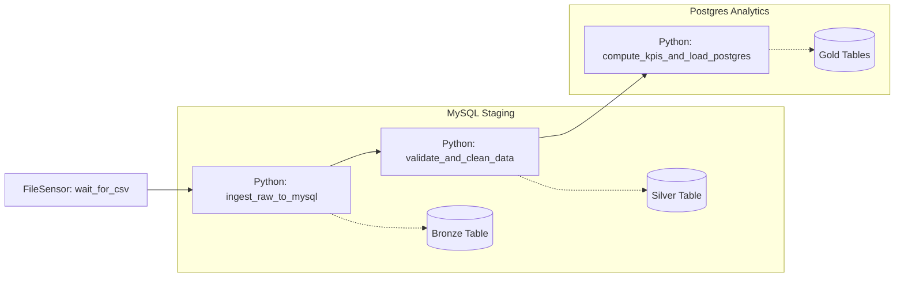

# Project Report: Bangladesh Flight Price Data Pipeline

## 1. Project Overview

This project involved building a robust, end-to-end data engineering pipeline to analyze flight pricing trends in Bangladesh. The goal was to move raw data from a Kaggle CSV dataset through a multi-stage **Medallion Architecture** to generate actionable insights regarding airline performance, seasonal price variations, and popular travel routes.

## 2. System Architecture

The pipeline is orchestrated using **Apache Airflow** and utilizes a containerized environment to ensure scalability and isolation. All data processing is performed using **Python and Pandas**, providing a lightweight and efficient solution for data transformation and KPI computation.

### Architecture Diagram

In a Medallion Architecture, data quality and structure improve as it moves through each layer. This approach ensures that I have a "single source of truth" (Bronze) while providing high-performance, refined data for the end user (Gold).


1. **Bronze Layer (MySQL):** The Raw Ingestion Zone
   The primary goal of the Bronze layer is to capture the source data exactly as it exists in the original Kaggle CSV file.

- **Immutable Storage:** Data is stored in its rawest form, serving as a permanent record of what was received.

- **Handling Raw Headers:** This layer was specifically designed to handle the original CSV column names, including spaces and units like Total Fare (BDT) and Arrival Date & Time.

- **No Transformation:** No logic is applied here; the priority is high-speed bulk loading using Pandas `to_sql()` to ensure the data is safe within the database environment.

2. **Silver Layer (MySQL):** The Validated & Cleaned Zone
   The Silver layer is where the "heavy lifting" of data quality occurs. This layer acts as the foundation for all downstream analytical processing.

- **Data Validation:** The `silver.py` module enforces data contracts using Pandas, such as ensuring no null values exist for critical fields like "Airline".

- **Corrected Calculations:** A key business logic step here is re-calculating the Total Fare to ensure it accurately reflects the sum of Base Fare + Tax & Surcharge.

- **Standardization:** Data types are cast from general strings (from the CSV) into proper numeric types using `pd.to_numeric()`, making the data ready for analytical processing.

3. **Gold Layer (PostgreSQL):** The Curated Analytics Zone
   The Gold layer is the final destination, containing data that has been aggregated and optimized for specific business questions.

- **Aggregated KPIs:** Unlike previous layers, Gold does not contain every individual flight record. Instead, it stores summaries like Average Fare by Airline or Booking Counts computed using Pandas `groupby()` operations.

- **Seasonal Insights:** Using Pandas string matching with regex patterns, data is categorized into "Peak" and "Non-Peak" seasons (identifying Eid and Winter holidays) to compare pricing trends.

- **Business Intelligence Ready:** By moving the final output to PostgreSQL using SQLAlchemy, the data is separated from the staging environment, allowing BI tools or stakeholders to query high-speed tables like gold_popular_routes without affecting the main pipeline.

## Airflow DAG & Task Description

This section provides a detailed breakdown of the flight_price_analysis_pipeline DAG. The pipeline is designed following the Medallion Architecture, ensuring data moves through structured stages of refinement.

### DAG Overview

- DAG ID: flight_price_analysis_pipeline
- Schedule: @daily (configurable)
- Owner: Courage
- Purpose: Orchestrates the ingestion of Bangladesh flight data from CSV to a PostgreSQL analytics warehouse using Python and Pandas.

**Detailed Task Descriptions**

The DAG consists of four primary tasks that handle the data lifecycle from extraction to aggregation.

### Airflow DAG Task Breakdown

| Task ID                          | Operator       | Description                                                                                                                                                                                                                |
| -------------------------------- | -------------- | -------------------------------------------------------------------------------------------------------------------------------------------------------------------------------------------------------------------------- |
| `wait_for_csv`                   | FileSensor     | Monitors a specific local directory for the arrival of the Kaggle CSV dataset. The pipeline only begins once the file is detected.                                                                                         |
| `ingest_raw_to_mysql`            | PythonOperator | Performs a bulk load of the raw CSV data into the MySQL Bronze Layer (`flight_prices_raw`) using Pandas `read_csv()` and `to_sql()`. It preserves all original headers and raw strings.                                    |
| `validate_and_clean_data`        | PythonOperator | Executes the `silver.py` module. It filters nulls, standardizes data types using `pd.to_numeric()`, and re-calculates the **Total Fare** to ensure data integrity in the Silver Layer.                                     |
| `compute_kpis_and_load_postgres` | PythonOperator | Executes the `gold.py` module to perform aggregations using Pandas `groupby()`. It computes seasonal variations (Peak vs. Non-Peak) and popular routes, then writes results to the PostgreSQL Gold Layer using SQLAlchemy. |

### Architecture Deep Dive



**1. The Ingestion Logic (Bronze)**

- **Module:** `bronze.py` - Uses Pandas for CSV loading and SQLAlchemy for database interaction.
- **Schema Preservation:** The ingestion task is configured to handle the specific naming conventions found in the Bangladesh flight dataset, such as `Total Fare (BDT)`.
- **Atomic Operations:** Uses a staging table (`flight_prices_raw_stg`) with an atomic swap pattern via `TRUNCATE` + `INSERT` to ensure data consistency.
- **Ingestion Timestamp:** Automatically adds an `ingestion_timestamp` column to track when data was loaded.

**2. The Transformation Logic (Silver)**

- **Module:** `silver.py` - Pure Pandas transformation functions for testability.
- **Business Rules:** This task applies the rule: $Total Fare = Base Fare + Tax$ to correct any inconsistencies in the source data using Pandas arithmetic operations.
- **Data Type Conversion:** Uses `pd.to_numeric()` with `errors='coerce'` to safely convert string values to numeric types.
- **Null Handling:** Drops records with null values in critical columns like 'Airline' and 'Total Fare (BDT)'.

**3. The Analytical Logic (Gold)**

- **Module:** `gold.py` - Pure Python/Pandas implementation for KPI computation.
- **Pandas Processing:** Leverages Pandas `groupby()` and `agg()` functions to compute aggregated metrics efficiently.
- **Seasonal Categorization:** Uses `str.contains()` with regex patterns to categorize records into Peak (Eid/Winter) and Non-Peak categories.
- **Result Persistence:** The final output is written to PostgreSQL using SQLAlchemy's `to_sql()` method with `if_exists='replace'` for idempotent runs.

## KPI Definitions and Computation Logic

### 1. Seasonal Fare Variation

This KPI identifies how flight prices fluctuate during high-demand periods in Bangladesh compared to standard travel dates.

- **Definition:** The average `Total Fare` grouped by seasonal categories: **Peak** (Holidays) and **Non-Peak** (Regular).
- **Computation Logic:**
  - **Categorization:** Pandas `str.contains()` with regex pattern scans the `Seasonality` column.
  - **Classification:**
    - **Peak:** Any record containing keywords such as "Winter", "Eid", or "Holiday".
    - **Non-Peak:** All other travel dates.
- **Aggregation:**
  $$Avg\_Fare = \frac{\sum Total\_Fare}{Count(Flights)}$$
  This is calculated for each category using `df.groupby('season_category').agg()` and loaded into `gold_seasonal_analysis`.

### 2. Top 10 Popular Routes

This KPI highlights the most frequently traveled corridors, which is essential for understanding airline traffic and demand.

- **Definition:** The top 10 unique combinations of Source and Destination based on the total number of bookings.
- **Computation Logic:**
  - **Grouping:** Pandas groups the data by the composite key `(Source, Destination)`.
  - **Counting:** Uses `df.groupby([source_col, dest_col]).size()` to count each group.
  - **Ranking:** Uses `sort_values('route_booking_count', ascending=False)` to order results.
  - **Result:** Data is persisted in `gold_popular_routes`.

### 3. Airline Performance Metrics

This KPI evaluates the market presence and pricing strategy of different airlines operating within the region.

- **Definition:** A per-airline breakdown of average pricing and total flight volume.
- **Computation Logic:**
  - **Average Fare:** Computed using `df.groupby(airline_col).agg(avg_fare=(fare_col, 'mean'))` after validation in the Silver layer.
  - **Flight Volume:** Computed using `agg(booking_count=(fare_col, 'count'))` per Airline.
  - **Persistence:** These metrics are stored in `gold_airline_performance` to allow for side-by-side competitiveness analysis.

## Technology Stack

| Component             | Technology              | Purpose                                     |
| --------------------- | ----------------------- | ------------------------------------------- |
| Orchestration         | Apache Airflow          | DAG scheduling and task management          |
| Data Processing       | Python + Pandas         | All ETL transformations and KPI computation |
| Staging Database      | MySQL                   | Bronze and Silver layer storage             |
| Analytics Database    | PostgreSQL              | Gold layer KPI storage                      |
| Database Connectivity | SQLAlchemy              | ORM for database operations                 |
| Containerization      | Docker + Docker Compose | Environment isolation and deployment        |
| Testing               | pytest                  | Unit testing for ETL modules                |

## Project Structure

```
├── airflow/
│   └── dags/
│       ├── flight_pipeline_dag.py    # Main DAG definition
│       └── etl_modules/
│           ├── bronze.py             # Raw data ingestion
│           ├── silver.py             # Data validation & cleaning
│           └── gold.py               # KPI computation
├── tests/
│   ├── test_silver.py                # Silver layer unit tests
│   └── test_gold.py                  # Gold layer unit tests
├── sql/                              # Database initialization scripts
├── data/                             # Source data directory
├── docker-compose.yml                # Container orchestration
├── Dockerfile                        # Custom Airflow image
└── requirements.txt                  # Python dependencies
```

## Challenges Encountered and How They Were Resolved

### 1. Environment & Infrastructure Challenges

#### MySQL Connection Configuration

- **Challenge:** Initial database connections failed due to misconfigured Airflow connection strings and SQLAlchemy engine parameters.
- **Resolution:** Properly configured the `mysql_staging` connection in Airflow UI and used the `MySqlHook` to obtain SQLAlchemy engines for Pandas operations.

#### Atomic Table Updates

- **Challenge:** Direct `to_sql()` with `if_exists='replace'` could leave the pipeline in an inconsistent state if the operation failed mid-write.
- **Resolution:** Implemented a staging table pattern (`flight_prices_raw_stg`) with atomic swap using `TRUNCATE` + `INSERT` within a database transaction to ensure data consistency.

### 2. Data Processing & Logic Challenges

#### Complex Schema & Special Characters

- **Challenge:** The raw Bangladesh flight dataset contained headers with spaces and special characters, such as `Total Fare (BDT)` and `Arrival Date & Time`. These caused issues during column name handling.
- **Resolution:** Preserved the original column names in the Bronze Layer and used Pandas' flexible column name handling. The Gold layer `gold.py` module dynamically detects column naming conventions (e.g., checking for both 'total_fare_bdt' and 'Total Fare (BDT)').

#### Inconsistent Fare Calculations

- **Challenge:** Some records in the source data had mismatched `Total Fare` values compared to the sum of `Base Fare` and `Tax`.
- **Resolution:** During the Silver Layer transformation in `silver.py`, implemented a validation function that recalculates the total: $Total\ Fare = Base\ Fare + Tax$. This ensures that all downstream KPI calculations in the Gold layer are based on verified financial figures.

#### Data Type Handling

- **Challenge:** CSV data is loaded as strings by default, which can cause issues during aggregation and arithmetic operations.
- **Resolution:** Used `pd.to_numeric(df[col], errors='coerce')` to safely convert string values to numeric types, handling any malformed data gracefully by converting to NaN.

### 3. Testing & Code Quality Challenges

#### Testability of ETL Functions

- **Challenge:** ETL functions tightly coupled to database connections are difficult to unit test.
- **Resolution:** Refactored ETL modules into pure functions that accept DataFrames as input and return DataFrames as output. Database I/O is handled in wrapper functions within the DAG file, allowing the core logic in `silver.py` and `gold.py` to be tested with mock DataFrames.

#### Managing Column Name Variations

- **Challenge:** Different parts of the pipeline use different column naming conventions (raw headers vs. snake_case).
- **Resolution:** Implemented dynamic column detection in `gold.py` that checks for both naming styles:

```python
fare_col = 'total_fare_bdt' if 'total_fare_bdt' in df.columns else 'Total Fare (BDT)'
```

## Conclusion

The successful implementation of this flight price analysis pipeline demonstrates a robust application of the Medallion Architecture, effectively moving data from a raw, immutable Bronze layer to a highly refined Gold analytics layer. By leveraging **Python and Pandas** for all data transformations and KPI computations, the pipeline achieves a lightweight yet powerful solution that is both easy to maintain and test. The orchestration with Apache Airflow, combined with MySQL staging and PostgreSQL analytics databases in a containerized Docker environment, provides a scalable foundation for data processing. This approach ensures that critical business metrics like seasonal fare variations, popular route identification, and airline performance are computed with high integrity and ready for strategic decision-making.
