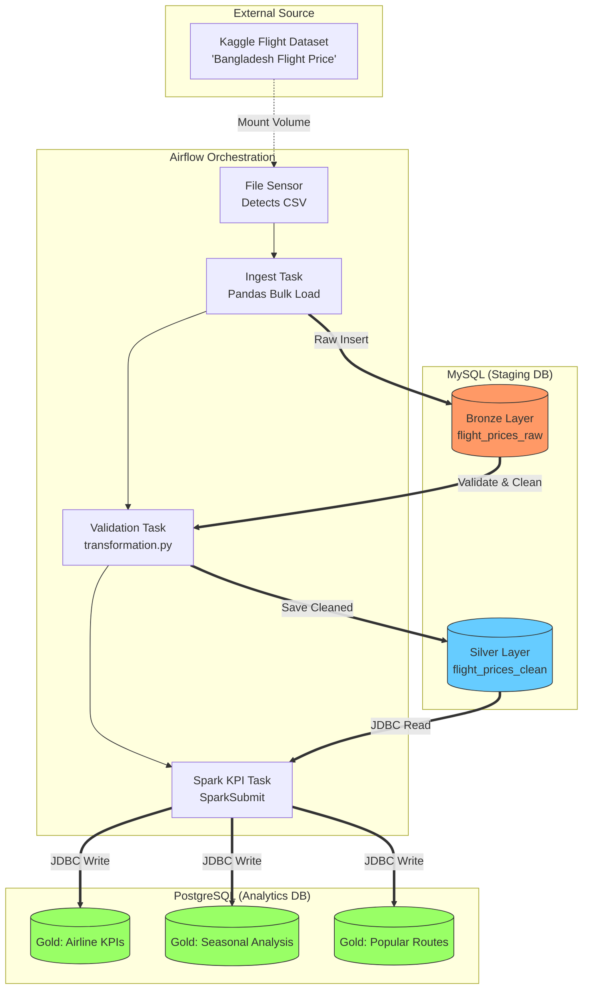

# Project Report: Bangladesh Flight Price Data Pipeline

## 1. Project Overview
This project involved building a robust, end-to-end data engineering pipeline to analyze flight pricing trends in Bangladesh. The goal was to move raw data from a Kaggle CSV dataset through a multi-stage **Medallion Architecture** to generate actionable insights regarding airline performance, seasonal price variations, and popular travel routes.

## 2. System Architecture
The pipeline is orchestrated using **Apache Airflow** and utilizes a containerized environment to ensure scalability and isolation.

### Architecture Diagram
In a Medallion Architecture, data quality and structure improve as it moves through each layer. This approach ensures that I have a "single source of truth" (Bronze) while providing high-performance, refined data for the end user (Gold).

1. **Bronze Layer (MySQL):** The Raw Ingestion Zone
The primary goal of the Bronze layer is to capture the source data exactly as it exists in the original Kaggle CSV file.

* **Immutable Storage:** Data is stored in its rawest form, serving as a permanent record of what was received.

* **Handling Raw Headers:** This layer was specifically designed to handle the original CSV column names, including spaces and units like Total Fare (BDT) and Arrival Date & Time.

* **No Transformation:** No logic is applied here; the priority is high-speed bulk loading to ensure the data is safe within the database environment.

2. **Silver Layer (MySQL):** The Validated & Cleaned Zone
The Silver layer is where the "heavy lifting" of data quality occurs. This layer acts as the foundation for all downstream analytical processing.

* **Data Validation:** The transformation.py script enforces data contracts, such as ensuring no null values exist for critical fields like "Airline".

* **Corrected Calculations:** A key business logic step here is re-calculating the Total Fare to ensure it accurately reflects the sum of Base Fare + Tax & Surcharge.

* **Standardization:** Data types are cast from general strings (from the CSV) into decimals, integers, and timestamps, making the data compatible with Apache Spark.

3. **Gold Layer (PostgreSQL):** The Curated Analytics Zone
The Gold layer is the final destination, containing data that has been aggregated and optimized for specific business questions.

* **Aggregated KPIs:** Unlike previous layers, Gold does not contain every individual flight record. Instead, it stores summaries like Average Fare by Airline or Booking Counts.

* **Seasonal Insights:** Using Apache Spark, data is categorized into "Peak" and "Non-Peak" seasons (identifying Eid and Winter holidays) to compare pricing trends.

* **Business Intelligence Ready:** By moving the final output to PostgreSQL, the data is separated from the staging environment, allowing BI tools or stakeholders to query high-speed tables like gold_popular_routes without affecting the main pipeline.